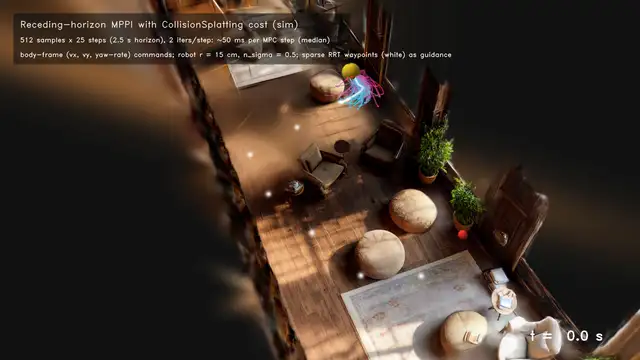
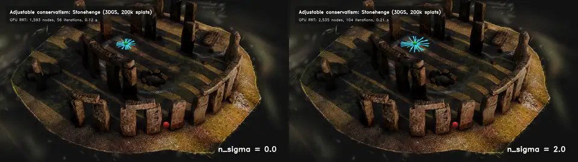
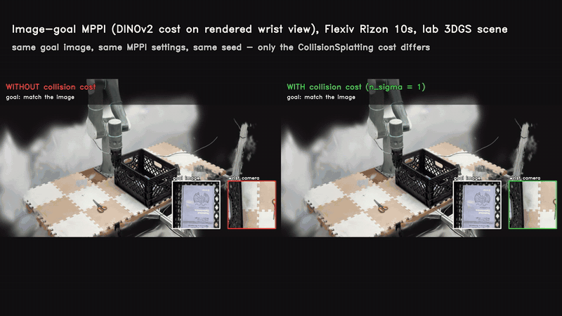
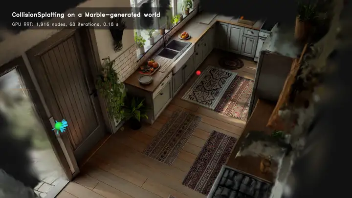
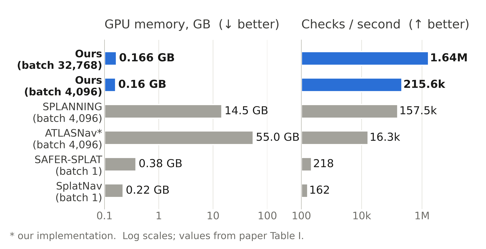

<div align="center">

# CollisionSplatting

**Collision-aware motion planning and control directly on standard 3D Gaussian Splatting scenes**

*IROS 2026* &nbsp;·&nbsp; Rooholla Khorrambakht, Joaquim Ortiz-Haro, Stephan Weiss, Ludovic Righetti



<sub>Receding-horizon MPPI (512 rollouts per step) scored with the CollisionSplatting cost directly on the raw 3DGS export of a <b>generated</b> library (World Labs Marble; simulated robot) — no mesh, no retraining.</sub>

</div>

> CollisionSplatting is a **fast, memory-light GPU collision kernel** with **tunable conservatism** that enables
> collision-aware planning and real-time control **directly on standard 3DGS scenes** — from SfM/SLAM captures to
> generative 3D worlds — with **no mesh conversion required**.

## Why

Gaussian splats are becoming the default way to capture, and now generate, photorealistic 3D worlds. Yet simulators
and planners still bolt a separate collision mesh onto them — from LiDAR, from artists, or a coarse approximation.
CollisionSplatting plans on the splats themselves:

| | |
|---|---|
| **Any standard 3DGS** | Reads the INRIA-format `.ply` written by 3DGS, 2DGS, gsplat, nerfstudio, Marble, …, and gsplat checkpoints. No normalized reconstruction, no mesh, no SDF. |
| **One knob for caution** | Each splat is an uncertain obstacle; its covariance is propagated into the distance. `n_sigma` trades clearance for reach, and large, poorly reconstructed splats automatically make the robot more careful. `n_sigma = 0` is a plain point-cloud check. |
| **Fast and memory-light** | One NVIDIA Warp kernel, spatial hashing and a streaming soft-min: O(1) state per query, no per-(query, splat) tensors. **0.16 GB vs. 14.5–55 GB** for batched baselines and **~1.6 M checks/s** in the paper (RTX PRO 6000). |
| **Planners included** | Batched GPU RRT, spline-parameterized MPPI, and batched URDF kinematics for multi-link ellipsoid robots. |
| **Image goals** | The scene stays renderable, so image-space objectives (e.g. DINOv2 features of the robot's rendered camera view) and collisions live in the same MPC loop. |

## How it works

For a robot link ellipsoid `E = {X : (X - c)ᵀ A (X - c) ≤ 1}` and a splat `N(μ, Σ)`:

```
s²   = (μ - c)ᵀ A (μ - c)                 scaling distance (< 1: the splat centre is inside the link)
σ²   = ∇s²ᵀ Σ ∇s²,   ∇s² = 2 A (μ - c)    first-order propagation of the splat's uncertainty
s̃²   = max(0, s² − n_σ · σ)               conservative distance;  collision ⇔ s̃² < 1
```

Distances are aggregated over the splats returned by a hash-grid neighbourhood query with a numerically stable
streaming log-mean-exp soft-minimum. The same kernel returns the RRT collision test (count of `s̃² < 1`), the
soft-min distance and the MPPI cost `mean_i d_max · exp(−γ · max(s̃²_i − 1, 0))`.

<div align="center">

<br><sub>Same start, goal and seed on 3DGS Stonehenge. <b>n<sub>σ</sub> = 0</b>: slips through the gap. <b>n<sub>σ</sub> = 2</b>: the gap closes and the planner goes around.</sub>
</div>

## Installation

```bash
git clone https://github.com/machines-in-motion/CollisionSplatting.git
cd CollisionSplatting
pip install -e .              # core: numpy, scipy, torch, warp-lang, plyfile
pip install -e ".[examples]"  # + gsplat (rendering), opencv, matplotlib, imageio for the examples
```

A CUDA GPU is recommended. The kernel also runs on CPU (Warp's CPU backend), which is what the unit tests use:
`pip install -e ".[dev]" && pytest`.

## Quick start

```python
import torch
from collisionsplatting import GaussianScene, CollisionChecker, BatchedRRT

scene = GaussianScene.from_ply("scene.ply").drop_floaters()   # any standard 3DGS export
checker = CollisionChecker(scene, n_sigma=1.0)

# batched queries: any leading shape, e.g. (samples, horizon, links)
res = checker.query(centers, axes, rotations)                 # centers (...,3), axes (...,3), rotations (...,3,3)
res.in_collision, res.distance, res.cost                      # RRT test, soft-min s̃², MPPI cost

free = checker.is_free(points, radius=0.05)                   # spheres / points

rrt = BatchedRRT(checker, lower, upper, body_axes=0.08, step_size=0.08)
plan = rrt.plan(start, goal)
path = rrt.postprocess(plan.path)                              # shortcut + collision-checked smoothing
```

## Examples

| Script | What it shows | Data |
|---|---|---|
| [`notebooks/quickstart.ipynb`](notebooks/quickstart.ipynb) | load, query, `n_sigma` sweep, RRT, rendering | downloaded automatically |
| [`examples/01_quickstart.py`](examples/01_quickstart.py) | collision queries on a generated world + throughput | downloaded automatically |
| [`examples/02_rrt_marble.py`](examples/02_rrt_marble.py) | 3D GPU RRT in a Marble kitchen, rendered in the splats | downloaded automatically |
| [`examples/03_mppi_navigation.py`](examples/03_mppi_navigation.py) | receding-horizon MPPI for a ground robot (RRT waypoints + CollisionSplatting cost) | downloaded automatically |
| [`examples/04_conservatism.py`](examples/04_conservatism.py) | plan the same query at several `n_sigma` | any `.ply` (paper: Stonehenge) |
| [`examples/05_flexiv_image_goal_mppi.py`](examples/05_flexiv_image_goal_mppi.py) | 7-DoF arm: DINOv2 image goal + collision cost in MPPI | lab scene checkpoint |
| [`examples/06_benchmark.py`](examples/06_benchmark.py) | throughput and memory | any `.ply` |

Marble sample worlds are fetched on demand from World Labs' public CDN
([export specs](https://docs.worldlabs.ai/marble/export/specs)); outputs go to `examples/outputs/`.

<table>
<tr>
<td align="center"><br><sub>Image-goal MPPI for a Flexiv Rizon 10s in the lab scene (simulated rerun): without the collision cost the end effector enters the crate; with it, it stays clear.</sub></td>
<td align="center"><br><sub>A batched GPU RRT planning for a flying robot in a generated kitchen (World Labs Marble).</sub></td>
</tr>
</table>

## Performance

<div align="center"></div>

Values from the paper's Table I (3DGS Stonehenge, ~200k splats, sphere robot). The kernel's working set is the splat
parameters plus the hash grid (~30 MB for 200k splats) and does not grow with the batch. `examples/06_benchmark.py`
reproduces the measurement on your GPU; `--search-radius 0.1` uses the paper's fixed neighbourhood, while the default
radius adapts to the robot and splat sizes and is typically several times faster.

## Conventions and tips

* **Quaternions** of splats are `(w, x, y, z)` (3DGS convention). Link orientations are passed as 3×3 rotation matrices.
* **Units and frames** are those of the scene. Marble exports are OpenCV-style (**y down**) and roughly metric; use
  `GaussianScene.transformed(T, scale)` to change frames.
* **Floaters**: `drop_floaters()` removes splats that are both nearly transparent and large (haze, reflections).
  Very large splats are also ignored by the kernel (`max_splat_scale`, 30× the median by default).
* **2DGS** disks (third scale 0) are handled natively; `GaussianScene.from_ply(..., flatten_2dgs=True)` forces it.

## Changes since the paper

* The splat rotation in the paper's evaluation code was applied transposed (the ellipsoid axes of anisotropic splats
  were mis-oriented when computing σ). This release uses the standard 3DGS convention, verified against the reference
  `build_rotation`. At `n_sigma = 0` results are identical; for `n_sigma > 0` the precision–recall curve on Stonehenge
  is the same or better at every recall level.
* Robot-link ellipsoids with arbitrary orientation are supported in the single public kernel.

## Citation

```bibtex
@inproceedings{khorrambakht2026collisionsplatting,
  title     = {CollisionSplatting: Collision-Aware Motion Planning in 3DGS Scenes with Image-Conditioned Objectives and Adjustable Conservatism},
  author    = {Khorrambakht, Rooholla and Ortiz-Haro, Joaquim and Weiss, Stephan and Righetti, Ludovic},
  booktitle = {IEEE/RSJ International Conference on Intelligent Robots and Systems (IROS)},
  year      = {2026}
}
```

## License

Released under the [GNU General Public License v3.0](LICENSE).

## Acknowledgements

Built on [NVIDIA Warp](https://github.com/NVIDIA/warp) and [gsplat](https://github.com/nerfstudio-project/gsplat).
Example worlds are public samples from [World Labs Marble](https://marble.worldlabs.ai); the image cost uses
[DINOv2](https://github.com/facebookresearch/dinov2).
